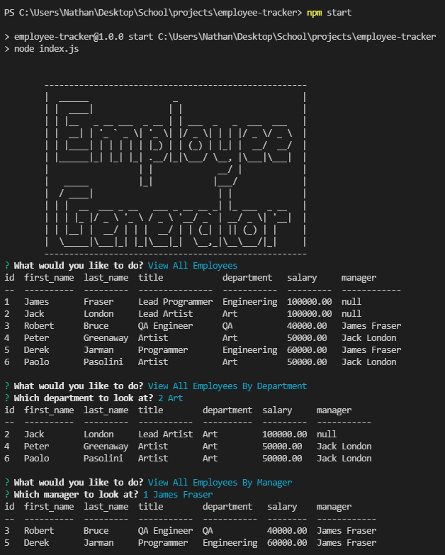

# Employee Tracker
  

  ## Description
  This project will prompt the user with a variety of questions about manipulating a company database. You are able to add, remove and update employees, roles and departments. And view different tables based on managers and departments each employee is in. You can also see the total budget of a department.

  
  ## Table of Contents
  * [Installation](#installation)
  * [Usage](#usage)
  * [License](#license)
  * [Contributing](#contributing)
  * [Tests](#tests)
  * [Questions](#questions)
  

  ## Installation
  You will need Node.js. Use "npm install" to install the packages. Log into mysql with "mysql -u root -p". Create and seed the database with "source db/db.sql", "source db/schema.sql" and "source db/seeds.sql". Then use "node index.js" to run.

  ## Usage
  [App usage video example](https://drive.google.com/file/d/1W96IbYjZaKA0w1nOIfZWxG-ktOn7ahpF/view)

  

  
  ## License
  Licensed under the [MIT](https://opensource.org/licenses/MIT) license. 

  Copyright 2021
  

  ## Contributing
  bobswiftfoot

  ## Tests
  No tests

  ## Questions
  Github Profile: [bobswiftfoot](https://github.com/bobswiftfoot)

  Email any questions to: [natepfau@yahoo.com](mailto:natepfau@yahoo.com)
  